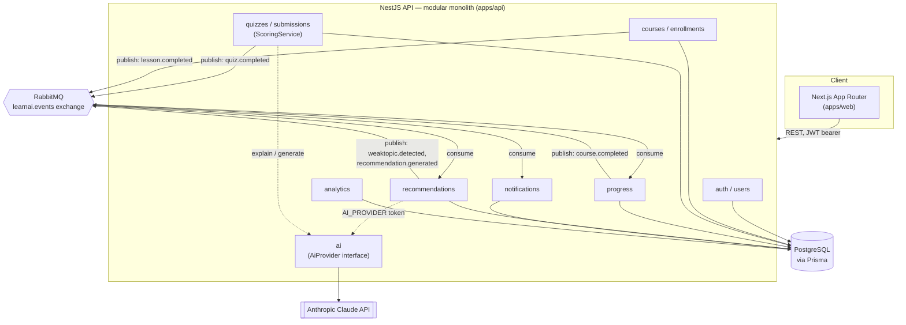
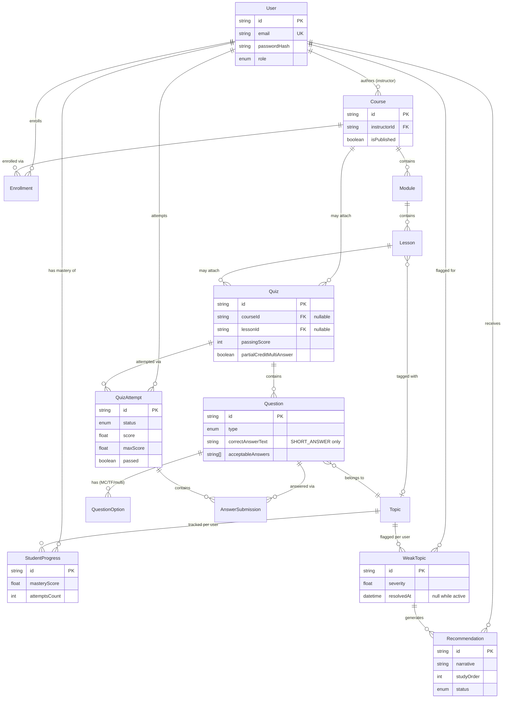
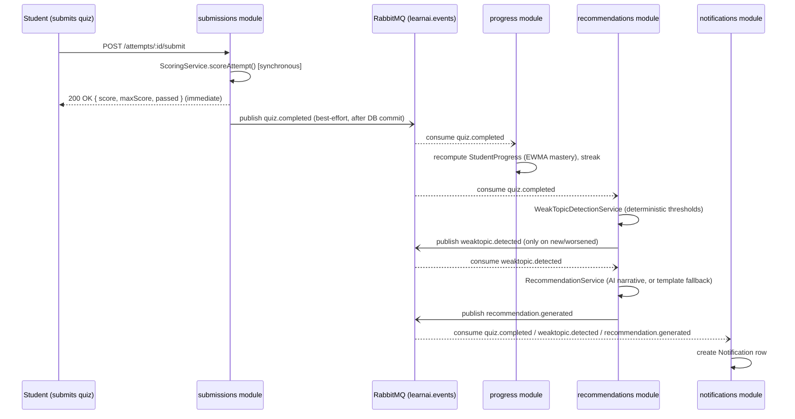

# LearnAI

An AI-powered learning and assessment platform: students take quizzes, LearnAI analyzes their performance to find knowledge gaps, and it generates personalized, AI-explained recommendations for what to study next. Instructors author courses and quizzes (with AI-assisted question drafting they review before publishing) and see cohort-level analytics.

This repository is a full-stack engineering sample — a modular-monolith NestJS API, a Next.js frontend, PostgreSQL via Prisma, an internal RabbitMQ event bus, and a real (swappable) LLM integration — built to demonstrate production-shaped architecture rather than a tutorial CRUD app.

> **Honesty note on verification**: this project was built in a sandbox without Docker, a running Postgres, or a running RabbitMQ instance available. Everything here has been type-checked (`tsc --noEmit`) and unit/integration-tested with a mocked Prisma client (144 Jest tests passing across 16 suites, see [Testing](#testing)), and the Prisma schema has been validated and used to generate a real initial migration. The Docker Compose stack and GitHub Actions CI pipeline are written carefully against the actual scripts/dependencies in this repo, but have **not** been executed end-to-end from this sandbox. Treat them as correct-by-construction and code-reviewed, not as proven-green.

---

## Table of Contents

- [Overview](#overview)
- [Architecture](#architecture)
- [Technology Choices](#technology-choices)
- [Database Design](#database-design)
- [API Documentation](#api-documentation)
- [Authentication & Authorization](#authentication--authorization)
- [AI Architecture](#ai-architecture)
- [Event-Driven Architecture](#event-driven-architecture)
- [Local Setup](#local-setup)
- [Docker](#docker)
- [Testing](#testing)
- [CI/CD](#cicd)
- [Design Decisions & Trade-offs](#design-decisions--trade-offs)
- [Future Improvements](#future-improvements)

---

## Overview

Most quiz apps stop at "here's your score." LearnAI treats an assessment attempt as a data point in a continuous feedback loop:

```
Take quiz → Score it → Recompute topic mastery → Detect weak topics
   → Generate a personalized recommendation → Notify the student
```

The problem this solves: students often don't know *what* to study next, and instructors don't have a systematic view of which concepts their cohort is actually struggling with. LearnAI's knowledge-gap detection is deterministic and rule-based (so it's testable and explainable), and AI is layered on top only where it adds real value — turning a ranked list of weak topics into a warm, specific, natural-language study plan; generating draft quiz questions for instructor review; explaining *why* a wrong answer is wrong; and answering study questions grounded in the student's own course content.

## Architecture

LearnAI is a **modular monolith**, not a microservices system. At this scope, separate deployable services would add operational overhead (service discovery, distributed tracing, network failure modes) without a corresponding benefit — a single NestJS process with clearly-bounded feature modules gets the same code-organization benefits with far less complexity. RabbitMQ is still used *inside* that one process, deliberately: it decouples "score a quiz" (must be synchronous — the student needs their score immediately) from "recompute mastery, detect weak topics, generate a recommendation, notify the student" (can happen a moment later, and benefits from being retried/redelivered independently of the HTTP request that triggered it).



## Technology Choices

| Layer | Choice | Why |
|---|---|---|
| Frontend | Next.js (App Router) + TypeScript + Tailwind | File-system routing matches the spec's route list directly; Tailwind keeps a consistent design system without a component library dependency. |
| Backend | NestJS + TypeScript | Opinionated module/DI structure scales cleanly to ~10 feature modules; first-class guards/interceptors/filters/Swagger support. |
| Database | PostgreSQL + Prisma | Real relational constraints (FKs, unique indexes) matter for enrollment/attempt integrity; Prisma gives type-safe queries and a migration workflow. |
| Auth | JWT (access + rotating refresh) + bcrypt + RBAC | Stateless access tokens scale horizontally; refresh rotation limits the blast radius of a leaked refresh token; RBAC via a `RolesGuard` keeps authorization declarative on each route. |
| AI | Anthropic Claude, behind an `AiProvider` interface | Four distinct, high-value capabilities (not a generic chatbot) — see [AI Architecture](#ai-architecture). Interface-first means the provider is swappable and mockable in tests. |
| Messaging | RabbitMQ via `@golevelup/nestjs-rabbitmq` | Decouples synchronous scoring from asynchronous progress/recommendation/notification processing — see [Event-Driven Architecture](#event-driven-architecture). |
| Testing | Jest | Unit tests against a mocked Prisma client (`jest-mock-extended`) for fast, DB-free coverage of business logic; the same suite runs against real Postgres/RabbitMQ service containers in CI. |
| DevOps | Docker Compose + GitHub Actions | Compose brings up Postgres/RabbitMQ/API/web as one stack; CI lints, typechecks, tests against real service containers, and builds the frontend. |

## Database Design

Prisma schema: [`apps/api/prisma/schema.prisma`](apps/api/prisma/schema.prisma). Simplified ER diagram (a few supporting tables — `RefreshToken`, `Notification`, `AiGeneratedQuestionDraft`, `CourseProgress`, `ActivityEvent` — are omitted here for readability; see the schema file for the full model):



Design choices specific to this schema:
- **Modules/Lessons live inside `Course`**, not a separate bounded module — they share Course's permission model and lifecycle, so splitting them out would add coupling without decoupling anything real.
- **`Quiz` doubles as both a lesson quiz and a course-final assessment**, distinguished by a nullable `lessonId` vs `courseId` — avoids a redundant `Assessment` table that would just duplicate `Quiz`.
- **Choice-based question types share one `QuestionOption` table** (`TRUE_FALSE` is just two options); `SHORT_ANSWER` instead uses `correctAnswerText` + `acceptableAnswers[]` with normalized exact-match grading (see [Design Decisions](#design-decisions--trade-offs)).
- **`AiGeneratedQuestionDraft` is a staging table** — an AI-generated question never becomes a real, gradeable `Question` until an instructor approves and publishes it, which performs the actual `Question`/`QuestionOption` insert transactionally.
- One `Enrollment` per `(userId, courseId)`; at most one `IN_PROGRESS` `QuizAttempt` per `(userId, quizId)` (enforced at the service layer).

## API Documentation

Interactive OpenAPI/Swagger docs are served at **`/api/docs`** once the API is running (the whole API is versioned under `/api/v1/*`). Major route groups (see [`apps/api/src/modules`](apps/api/src/modules)):

| Module | Example routes |
|---|---|
| `auth` | `POST /auth/register`, `POST /auth/login`, `POST /auth/refresh`, `POST /auth/logout` |
| `users` | `GET /users/me`, `PATCH /users/:id/role` (ADMIN) |
| `courses` | `GET /courses`, `GET /courses/:id`, `POST /courses` (INSTRUCTOR/ADMIN), `POST /courses/:id/publish` |
| `modules` / `lessons` | `POST /courses/:id/modules`, `POST /modules/:id/lessons`, `POST /lessons/:id/complete` |
| enrollments | `POST /courses/:id/enroll`, `GET /enrollments/me`, `GET /courses/:id/enrollments` |
| `quizzes` / `questions` | `POST /quizzes`, `POST /quizzes/:id/questions`, `GET /quizzes/:id` (answer key stripped for students) |
| submissions | `POST /quizzes/:id/attempts`, `PATCH /attempts/:id/answers`, `POST /attempts/:id/submit`, `GET /attempts/:id` |
| `progress` | `GET /progress/me`, `GET /progress/courses/:id` |
| recommendations | `GET /recommendations/me`, `GET /weak-topics/me`, `PATCH /recommendations/:id/dismiss` |
| `ai` | `POST /ai/questions/generate`, `GET /ai/drafts`, `POST /ai/drafts/:id/publish`, `POST /ai/study-assistant/ask`, `POST /ai/explain/:answerSubmissionId` |
| `notifications` | `GET /notifications/me`, `PATCH /notifications/:id/read` |
| `analytics` | `GET /analytics/courses/:id`, `GET /analytics/students/:id`, `GET /analytics/platform` (ADMIN) |

## Authentication & Authorization

- **Passwords**: hashed with bcrypt (cost factor 12) — never stored or logged in plaintext.
- **JWT access tokens** (15 min default, `JWT_ACCESS_EXPIRES_IN`) are short-lived and stateless; **refresh tokens** (7 day default) are opaque random strings, stored server-side only as a SHA-256 hash (`RefreshToken.tokenHash`) so a leaked database dump doesn't reveal usable tokens. Refreshing **rotates** the token: the old one is marked `revokedAt` and linked via `replacedByTokenId` to the new one, so reuse of a revoked token is detectable and rejected.
- **RBAC**: three roles (`STUDENT`, `INSTRUCTOR`, `ADMIN`). A global `JwtAuthGuard` requires a valid access token on every route by default (`@Public()` opts a route out — used for register/login/refresh); a global `RolesGuard` reads a `@Roles(...)` decorator per-route. Ownership checks (an instructor may only edit *their own* course/quiz) are enforced in the service layer, not just role checks, so one instructor can never touch another's content.
- **Rate limiting**: `@nestjs/throttler` globally, with stricter per-route limits on `/auth/*` and the LLM-backed `/ai/*` endpoints.
- **Frontend token storage** (documented simplification): the SPA stores the access and refresh tokens in regular (non-httpOnly) cookies set by client-side JS after login (see [`apps/web/lib/cookies.ts`](apps/web/lib/cookies.ts)), rather than httpOnly cookies set via the API's `Set-Cookie` header. This keeps the API a plain, easily-curlable JSON REST service across two dev origins (`localhost:3000` / `localhost:3001`) without a same-site proxy, at the cost of tokens being readable by any script on the page (XSS exposure). For a production deployment this should move to httpOnly, `SameSite=strict` cookies set by the API behind a shared-origin reverse proxy — see [Future Improvements](#future-improvements).

## AI Architecture

All AI calls go through one interface, [`AiProvider`](apps/api/src/modules/ai/ai-provider.interface.ts), bound via a DI token (`AI_PROVIDER`) to a concrete [`AnthropicProvider`](apps/api/src/modules/ai/anthropic.provider.ts) — swappable for a different vendor, and trivially mockable in tests (every consumer test mocks the interface, never the Anthropic SDK directly). Four capabilities, each deliberately narrow rather than a general-purpose chatbot:

1. **AI quiz generation with instructor approval** — an instructor requests N questions for a topic/difficulty; the model returns structured drafts (validated against a Zod schema) which land in `AiGeneratedQuestionDraft` with `status: PENDING`. Nothing is gradeable yet. The instructor reviews, optionally edits, and approves; a separate publish step transactionally creates the real `Question`/`QuestionOption` rows. AI never writes directly to live quiz content.
2. **Wrong-answer explanation** — given a student's incorrect submission, the model explains why the correct answer is correct and why the selected answer is a common misconception, grounded in the question's own `explanation` field where one exists.
3. **Recommendation narrative generation** — this is the one place the two-stage design matters most: [`WeakTopicDetectionService`](apps/api/src/modules/recommendations/weak-topic-detection.service.ts) is 100% deterministic rule-based logic (mastery thresholds, minimum attempt counts, severity ranking — see below) with zero AI involved, fully unit-testable without mocking anything. Only the *narrative and study-order explanation* layer calls the AI, and it's explicitly instructed to explain/order the already-ranked candidates it's given, never to invent new topics or re-rank by its own judgment. If the AI call fails or `ANTHROPIC_API_KEY` isn't configured, [`RecommendationService`](apps/api/src/modules/recommendations/recommendation.service.ts) falls back to a deterministic templated sentence instead of failing the pipeline.
4. **Study assistant** — a chat endpoint grounded in the *student's own* data: their current topic mastery, active weak topics, and a couple of relevant lesson excerpts, injected as context. It's instructed to answer only from that context plus general tutoring reasoning, and to say plainly "I don't have that in your course material yet" rather than hallucinate — this is what "constrained to available educational content" means in practice here.

Knowledge-gap detection walkthrough (the exact example from the product spec; [`prisma/seed.ts`](apps/api/prisma/seed.ts) seeds this same five-topic taxonomy, course, and quiz, so taking the quiz a few times as the seeded student and deliberately missing the transactions/normalization questions reproduces this scenario):

```
Database Fundamentals   82%        Primary weakness:      Database Transactions
SQL Joins               76%   →    Secondary weakness:    Normalization
Normalization           41%
Transactions            38%
Indexing                69%
```

Rule: a topic needs ≥3 attempts before it's evaluated at all (avoids flagging on one unlucky question); `masteryScore < 50` is a primary weakness (triggers the async recommendation pipeline); `50–70` is a secondary "watch" zone (visible on `/recommendations`, but doesn't spam a notification); `≥ 70` resolves any existing flag. Active weak topics are ranked by `severity = 100 - masteryScore`, descending — Transactions (62 severity) outranks Normalization (59 severity) in the example above.

If `ANTHROPIC_API_KEY` is unset, every `/ai/*` endpoint that calls the model returns a `503` (`AiUnavailableException`) instead of crashing the process — the rest of the platform (auth, courses, quizzes, scoring, progress, rule-based weak-topic detection) works fully without an API key.

## Event-Driven Architecture



**Quiz scoring itself is fully synchronous** — the score is computed and returned in the HTTP response before any event is published. Only the *downstream enrichment* (mastery recalculation, weak-topic detection, recommendation generation, notification creation) is asynchronous, because none of it needs to block the student getting their result, and all of it is safe to redeliver/retry independently.

Implementation: one durable topic exchange, `learnai.events` (+ a `.dlx` dead-letter exchange), via `@golevelup/nestjs-rabbitmq`. Routing keys: `quiz.completed`, `lesson.completed`, `course.completed`, `assessment.submitted`, `weaktopic.detected`, `recommendation.generated` (see [`packages/shared/src/events.ts`](packages/shared/src/events.ts)). One durable queue per consumer *group* (e.g. `progress.quiz-completed`, `recommendations.weak-topic-detection`, `notifications.recommendation-ready`) so a slow consumer never blocks another. Every `@RabbitSubscribe` handler is a thin wrapper delegating to a plain, directly-callable service method — tests invoke those methods with a constructed event payload and never require a live broker.

## Local Setup

Requires Node.js 20+ and a running PostgreSQL + RabbitMQ (either installed locally or via `docker compose up postgres rabbitmq`, see [Docker](#docker)).

```bash
git clone <this-repo>
cd LearnAI
npm install

cp apps/api/.env.example apps/api/.env
cp apps/web/.env.example apps/web/.env
# edit apps/api/.env: point DATABASE_URL / RABBITMQ_URL at your local instances,
# set JWT_ACCESS_SECRET / JWT_REFRESH_SECRET, and optionally ANTHROPIC_API_KEY

npm run build -w @learnai/shared
npm run prisma:generate -w apps/api
npm run prisma:migrate -w apps/api      # applies apps/api/prisma/migrations
npm run prisma:seed -w apps/api         # optional: demo users + a full course/quiz

npm run dev:api   # terminal 1 — http://localhost:3001, Swagger at /api/docs
npm run dev:web   # terminal 2 — http://localhost:3000
```

Seeded demo accounts (password `Passw0rd!` for all three):

| Role | Email |
|---|---|
| ADMIN | `admin@learnai.dev` |
| INSTRUCTOR | `instructor@learnai.dev` |
| STUDENT | `student@learnai.dev` |

## Docker

```bash
docker compose up --build
```

Brings up `postgres`, `rabbitmq` (management UI at `http://localhost:15672`, user/pass `learnai`/`learnai`), `api` (`http://localhost:3001`, runs `prisma migrate deploy` automatically on boot), and `web` (`http://localhost:3000`). Seeding is a separate manual step after the stack is up:

```bash
docker compose exec api npx prisma db seed
```

Set `ANTHROPIC_API_KEY` in your shell (or a root `.env` picked up by Compose) before `up` if you want the AI endpoints to work; otherwise the app runs fine with AI endpoints returning `503`.

## Testing

```bash
npm run test:api            # Jest: 144 tests / 16 suites, run against a mocked Prisma client
npm run test:cov -w apps/api  # same, with coverage
```

No live database is needed to run these locally — every suite uses `jest-mock-extended`'s `mockDeep<PrismaService>()` and asserts on the exact Prisma calls made plus the business logic around them. Coverage focuses on what the spec calls out as high-value, not trivial getters:

- **Scoring engine** (`scoring.service.spec.ts`) — every question type, multi-answer partial-credit edge cases, pass/fail boundary, divide-by-zero guard. Pure functions, zero mocking.
- **Auth** (`auth.service.spec.ts`) — register/login, refresh rotation + reuse detection, logout.
- **Authorization** — cross-instructor and cross-role denial in `courses`, `quizzes`, `analytics`.
- **Submissions** (`attempts.service.spec.ts`) — single in-progress attempt enforcement, double-submit rejection.
- **Progress calculation** (`progress.service.spec.ts`) — EWMA mastery math, streak gap/continue/same-day logic, course-completion percentage.
- **Recommendation logic** (`weak-topic-detection.service.spec.ts`, `recommendation.service.spec.ts`) — threshold boundaries, idempotent regeneration, AI-fallback behavior with a mocked `AiProvider`.
- **AI provider** (`anthropic.provider.spec.ts`) — throws cleanly with no API key configured; validates/rejects malformed model responses rather than trusting them.
- **Enrollment**, **notifications**, **analytics** aggregation math.

CI additionally runs the same suite against real Postgres + RabbitMQ service containers (see below) — that path has been written and reviewed but not executed from this sandbox.

## CI/CD

[`.github/workflows/ci.yml`](.github/workflows/ci.yml), three jobs on every push/PR to `main`:

1. **lint-and-typecheck** — ESLint + `tsc --noEmit` for both apps.
2. **test-api** — Postgres 16 + RabbitMQ 3 as GitHub Actions service containers, `prisma migrate deploy` against the real service Postgres, then the full Jest suite with coverage.
3. **build-web** — production Next.js build.

## Design Decisions & Trade-offs

- **Modular monolith, not microservices** — right-sized for this scope; RabbitMQ provides the decoupling benefit internally without the operational cost of separate deployables.
- **No outbox pattern yet** — event publishing after a DB commit is best-effort (logged on failure, never fails the HTTP response). A dropped RabbitMQ message today means a delayed/missed progress recalculation, not corrupted data, but it's not exactly-once. A transactional outbox table + relay is the documented upgrade path.
- **UTC calendar-day streaks** — simpler and consistent across users, at the cost of being technically "wrong" right at a user's local midnight boundary.
- **Short-answer grading is exact-match after normalization** (trim/lowercase/whitespace-collapse/punctuation-strip against `correctAnswerText` + `acceptableAnswers[]`), not fuzzy or AI-graded — deterministic and instantly testable, at the cost of rejecting answers that are correct but oddly phrased.
- **Non-httpOnly cookie auth on the frontend** — see [Authentication & Authorization](#authentication--authorization); a documented dev-simplicity trade-off, not a production-ready pattern.
- **This project was built without live Docker/Postgres/RabbitMQ access in the author's sandbox.** The schema was validated with `prisma validate`, an initial migration was generated via `prisma migrate diff` (which doesn't require a live DB connection), and all backend logic was tested against a mocked Prisma client. The Docker Compose stack and CI pipeline are correct-by-construction against the real package scripts and dependencies, but have not been run end-to-end. This is stated plainly rather than claimed as verified.

## Future Improvements

- Transactional outbox for guaranteed at-least-once event delivery.
- Fuzzy or AI-assisted short-answer grading as an opt-in per question.
- httpOnly, `SameSite=strict` cookie auth via a shared-origin reverse proxy in production.
- WebSocket/SSE push for notifications instead of polling `GET /notifications/me`.
- Per-topic spaced-repetition scheduling on top of the existing mastery/streak data.
- Admin-configurable EWMA weight (`α`) and weak-topic thresholds, currently fixed constants.
